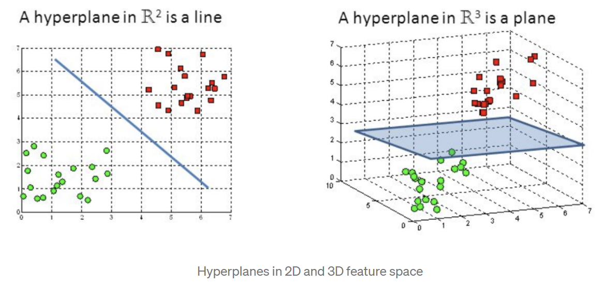
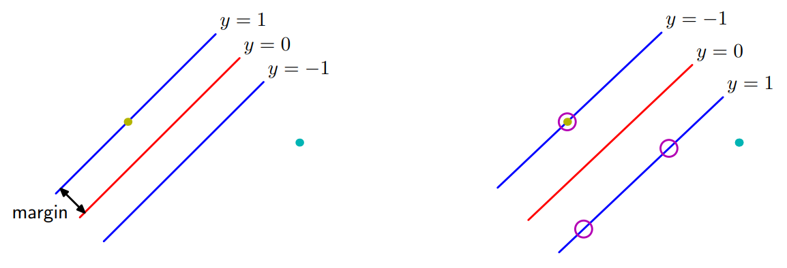

# 03 - SVM

This lecture continued and finished the topic of support vector machines. The main issue was to consider how non-linear data transformation can be used to make data that is not linear separable to begin with, lineally separable in a suitable feature space. The main tool for this are kernel functions, and this lecture specifically looked at how kernel function can be used to transform classification problems for structured data like string and graph into standard linear classification problems. 

## Keywords

__Hyperplane__: The dividing line in placed to separate the data
__Support Vector__: Samples on the edge of the boundary and are the most difficult to classify.
**Margin**: The distance separating the closest pair of data point belonging to opposite classes
**Feature space**: the space in which the data is represented after the transformation of the data

## Data Transformations

Any mapping 

$$\phi:\mathbb{R}^D\rightarrow\mathbb{R}^{D'}$$

defines how some original data x is turned into a transformed data instance $\phi(x)=(\phi_1(x), \dots, \phi_D(x))$, where the components $\phi_i(x)$ are called features or basis functions and the $\mathbb{R}^{D'}$ is the feature space of $\phi$. $D'$ is often greater than $D$ and $\phi$ is typically non-linear. The idea is that we want to make to non-linear data into some data we can apply linear models to.

## Support Vector Machine (SVM)

The objective of the SVM is to find a hyperplane in an N-dimensional space (N is the number of features) that distinctly classifies the datapoints.

We want to find the widest road between different samples, and this is done by considering the dot products of support vectors and the samples.

To separate two classes of data points, there are many possible hyperplanes. The objective is the find a plane that has the maximum margin, i.e the maximum distance between datapoints of both classes.

Hyperplanes are decision boundaries that help classify the datapoints. Datapoints falling on either side of the hyperplane can be attributed to different classes.

The dimensionality of the hyperplane depends on the number of features, if the input feature is 2, then the hyperplane is just a line. If the number of features is 3, then the hyperplane becomes a two-dimensional plane.

Support vectors are datapoints closer to the hyperplane and influence the position and orientation of the hyperplane. Using these support vectors, we maximize the margin of the classifier. Deleting the support vectors will change the position of the hyperplane.

The margin is the distance between the decision boundary and the closest of the datapoints. Maximizing the margin leads to a particular choice of decision boundary. The location of the boundary is determined by a subset of the datapoints known as support vectors, indicated by the circles on the right.

In SVM, we take the output of the linear function and if the output is greater than 1 we identify with one class and if the output is -1 we identify as another class.

### Overlapping Class Distribution

The idea of a training dataset without overlap is unrealistic. We therefore need to modify the SVM to allow some training points to be misclassified. The penalty is a linear function of the distance and in order to do this, a slack variable greater or equal to 0 is introduced. Each datapoint has a slackvariable, where:

- $S=0$ means it is inside the correct margin boundary
- $0<S\leq1$ means it is inside the margin, but on the correct side of the decision boundary.
- $S>1$ means it is on the wrong side of the decision boundary and is misclassified.

In the slides, this was mentioned as a simplification, but it was: The idea was that we want to calibrate $w,b$ so that for support vectors $x_n$:
$$y_n(w*x_n+b)=1$$
meaning, we want to multiply the margin with some value so it equals one (normalize the values). This is how we can always compare with 0, 1 and greater than 1.

The goal is to maximize the margin while softly penalizing points that lie on the wrong side of the margin boundary. We maximize:

$$C\sum_{n=1}^{N}S_n+\frac{1}{2}\left \| w \right \|^2$$

where the parameter $C>0$ controls the trade-off between the slack variable penalty and the margin.

### Loss function and gradient updates

In the SVM algorithm we aim to maximize the margin between the datapoints and the hyperplane.

The cost is 0 if the predicted and actual value is the same. Else the cost will be calculated.

## Nonlinear SVM

When features are not linearly separable, one way to solve this is by adding/removing dimensions (usually adding), and mapping datapoints to this new space using a kernel function. This new high-dimensional features space makes in possible to make it a linear classification problem again.

## Lagrange Multipliers

The SVM learning problem is solved using the method of Lagrange multipliers.

The point of the Lagrange optimization process is to determine the support vector $x_i$, the $\lambda_i$ and the $b$. The only operations required on data items is to compute dot products $x_i * x_j$. For classification we only need to compute dot products $x_i*z$

The method of Lagrange Multipliers is a simple and elegant method for finding the local minima or local maxima of a function subject to equality of inequality constraints.

The method of Lagrange multipliers first constructs a function called the Lagrange function as given by the following expression:

$$L(x,\lambda)=f(x)+\lambda_1 * g_1(x)+ \dots \lambda_n*g_n(x)$$

Here $\lambda$ represents a vector of Langrange multipliers, e.i.

$$\lambda = [\lambda_1, \lambda_2, \dots, \lambda_n]^T$$

To find the points of local minimum of $f(x)$ subject to the equality constraints, we find the stationary points of the Langrange function $L(x,\lambda)$, e.i. we solve the following equations:

$$\bigtriangledown xL=0$$
$$\delta L/\delta \lambda_i = 0 (for: i = 1,\dots, n)$$

Hence, we get a total of $m+n$ equations to solve, where:

- $m$: Number of variables in domain of f
- $n$: Number of equality constraints

In short, the points of local minimum would be solution of the following equations:

$$\delta L / \delta x_j = 0 (for: i = 1, \dots,m)$$
$$g_i(x) = 0 (for: i = 1, \dots,n)$$

### Mercers Theorem

Mercers Theorem determines which functions can be used as a kernel function. 

The Mercers Theorem stats that if a kernel function $K$ is symmetric, continuous and leads to a positive semi-definite matrix $P$ then there exists a function $\phi$ that maps $x_i$ and $x_j$ into another space (possible with higher deimensions) such that

$$K(x_i, x_j)=\phi(x_i)^T\phi(x_j)$$

So you can use $K$ as a kernel since you know $\phi$ exists, even if you do not know what $\phi$ is.

A kernel function $k(x,y)$ is an inner product between the samles where $k(x,y)=\left \langle \phi(x),\phi(y)  \right \rangle$. Valid kernel functions must satisfy the Mercers condition, namely $k(x,y)$ must equal $k(y,x)$.

### Matric Version of Mercers Theorem

A symmetric function $K(x,z)$ is on the form

$$K(x,z)=\phi(x)\cdot \phi(z)$$

For some feature mapping $\phi$, if and only if for all finite sets of points $x_1, \dots, x_n$ the kernel matrix is positive semi-definite.

### The Kernel Trick

When it is not possible to separate data in a low dimensionality, additional dimensions are added. This enables us to separate the data linearly, but when operations are performed with higher dimensions, this can lead to extremely high and impractical computation costs, especially if many dimensions are added.

This is what the kernel trick solves. The tick is that kernel methods represents the data only through a set of pairwise similarity comparisons between the original data in the low dimensionality, instead of applying the transformation, and representing the data in a higher dimensional feature space.

The benefit is that the objective function we are optimizing to fit the higher dimensional decision boundary only includes the dot product of the transformed vectors. Therefore we can just substitute these dot product terms with the kernel function without using $\phi(x)$, meaning we find the optimal hyperplane using the hither dimensional space, without having to calculate or in reality eve know anything about $\phi(x)$.

### Kernels

The kernel function is equal to the dot product of the transformed vectors.

Is a function which allows us to create a non-linear hyperplance. A kernel cannot be a kernel unless it satisfies Mercers theorem, which demans that the kernel should be a symmetric continuous function.

Basic kernels include:
- Polynomial Kernel: $(x*z+1)^p$
- Gaussian Kernel: $e^{-\left \| x - z \right \| / 2\sigma^2}$
- Hyperboloc Tangent: $tanh(k*x*z-\delta)$

## Kernels for Non Standard Data

When the data is non standard, kernels can still be used to classify.

### Term Frequency Vector

For text

A term frequency vector, is a vector where each index represents how many times the index occurs. This could be based on a text, where the vector will be words, and each index will be how many times a given word occurs in a text.

## Cosine Similarity

$$\text{cos-sim}(t_1, t_2)=cosine(0)=\frac{tf(t_1)\circ tf(t_2)}{\| tf(t_1) \ \circ \| tf(t_2) \|}$$

cos-sim is a positive semi-definite kernel: normalization of plain dot product. com-sim is extensively used in information retrieval as a measure of similarity between documents
- $t_1$: A short query text
- $t_2$: A candidate document that may be returned for query $t_1$

## Summary

SVM + Kernel Functions:

Advantages:
- Powerfull method for classification
- Successful applications, e.g. in bio-informatics
- Wide variety of data types and classification problems reduced to a single tyype of optimization problem

Disadvantages
- Binary classifier only: generalization to multiclass only via multipe binary classifiers
- Complexity quadratic in number of instances
- To find the “right” kernel function may require a lot of engineering

